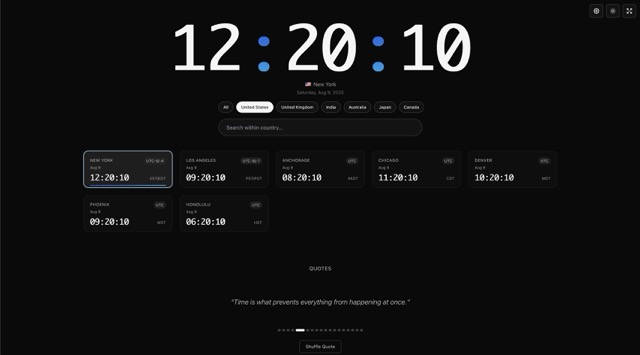
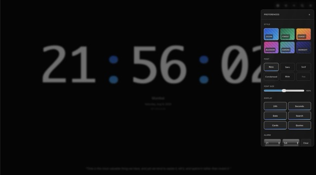
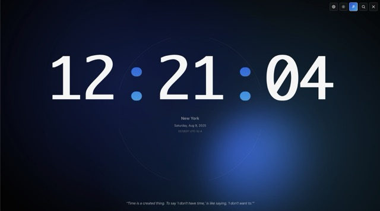
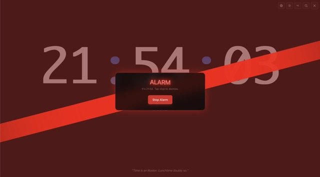
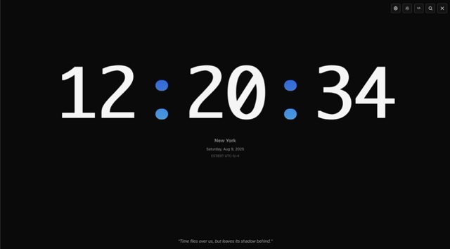

# WorldsTime
Network‑synced global clock (400+ zones) with country filter, fullscreen ambient, alarm, customization options, PWA & persistent prefs.

**Website:** https://worlds-time.vercel.app

## Screenshots

| Home Page | Settings Panel | Ambient Fullscreen | Alarm Ringing | Full Screen |
|-----------|----------------|-------------------|---------------|-----------|
|  |  |  |  |  |

## Features
- Accent theme selection
- Light / dark theme toggle
- Fullscreen mode with optional ambient background
- Custom alarm with animated alert
- 12h / 24h time toggle (alarm picker adapts)
- Local preference persistence (no backend required)
- Responsive layout
- Smooth animations

## Alarm

- Set time in Settings → Alarm
- Enable/disable with toggle
- Rings when local time matches stored HH:MM

Stored in a single preferences provider (React context + localStorage) covering:
`accent`, `timeFont`, `alarmEnabled`, `alarmTime`, `use24h`, `ambientEnabled` (fullscreen only), theme.

## Notes

- No external API calls; all local date math
- Works offline once loaded

## License

This project is licensed under the [MIT License](LICENSE).

## Contributing

Small focused PRs welcome (bug fixes, accessibility, performance). Open an issue first for larger changes.